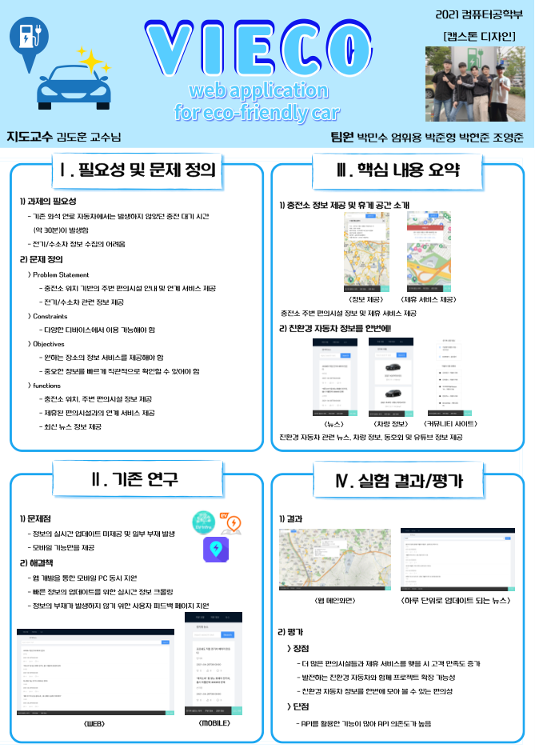

2021년 경기대학교 컴퓨터공학부 캡스톤 디자인

# viECO

viECO는 전기차/수소차의 충전소와 관련 및 연계되는 정보를 제공하는 서비스입니다.
Rest API형 서버로 클라이언트에게 API를 만들어 제공해주고 있습니다.
간단하며 편리한 사용 경험과 프론트엔드와의 매끄러운 개발 협업에 중점을 두어 설계되었습니다.

## 프로젝트 기간

2021.03 ~ 2021.06

## 프로젝트의 전체적인 구조

* 객체지향적인 개발을 위해 OOP 프레임워크인 Spring Boot를 사용하여 개발하였습니다.
* Github에서 main branch로 push하게 되면 CI, S3, CodeDeploy를 거쳐 자동으로 EC2 서버에 배포되게 됩니다.
* 배포된 Spring Boot 프로젝트가 WAS 서버 역할을 하게 됩니다.
* NGINX는 Github 페이지와 AWS 도메인의 SSL 인증서 문제를 해결하기 위해 사용하였습니다.

## 프로젝트의 주요 관심사

* Rest API를 만들고 프론트엔드에서 사용할 수 있게 해줌으로서 프론트엔드 개발자들과의 협업을 하였다.
* 직접 서버에 배포를 해보고 사용자들을 받아보았다.

### 코드 컨벤션

* Google code Style을 준수
* https://google.github.io/styleguide/javaguide.html

### 오픈 API 사용

* CORS 문제로 클라이언트 사이드 호출이 불가능하여 벡엔드를 경유해 사용
* 서버와 클라이언트 간에 access-control-allow-origin 헤더 설정으로 REST API 통신

### 뉴스, 자동차 정보 크롤링

* 친환경 자동차 관련 뉴스와 자동차 정보를 크롤링하여 DB에 삽입하고 데이터를 가공 후 REST API 통신

## 역할

**박준형**: 전체적인 백엔드 개발 총괄, Spring Boot를 통한 백엔드 개발, 배포

**박현준**: Python으로 필요한 데이터를 크롤링

## 사용 기술 및 환경

Spring Boot, Gradle, Spinrg Data JPA, MariaDB, Travis Ci, Java11, AWS, NGINX

## Wiki

비공개 Notion 워크스페이스에 기록

## CI/CD

Travis CI를 통해 Git에서 Push를 하면 자동 Build 및 Test 적용

## 주요 기능

## 발표 영상
https://drive.google.com/file/d/1KYUUMDfIHTYrsMOxEguistyCspA895Dz/view?usp=sharing

## 발표 자료 

